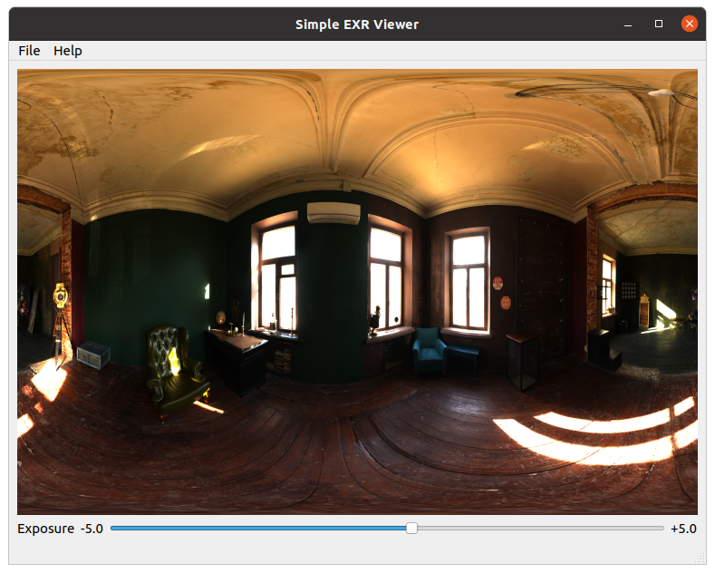
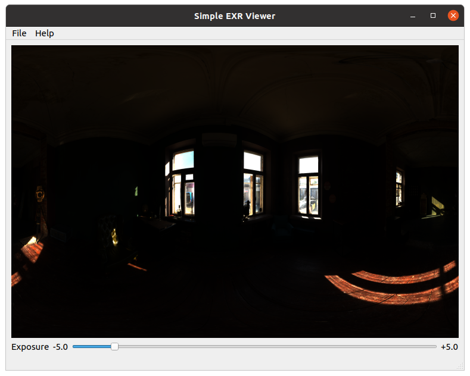

# Simple EXR viewer

> :warning: Application is still in development. No versions released yet.

The simple EXR viewer is a simple QT based application that can load EXR images.
Capabilities that must be supported:
* Sliding the exposure
* Converting EXR to LDR
* Saving EXR pictures to RGB or PNG.

## Installation

The application is distributed for the following platforms.

* Download the [Ubuntu20](dist/ubuntu20/simple-exr-viewer) executable.
* Other platforms need to build from source. More platforms will follow.

# Screenshots

Increasing the exposure slider scales up the pixel values. The bright parts get clamped to the maximum value, and the darker
parts of the image become visible.


Decreasing the exposure slider causes the pixel values to be scaled down. The bright parts of the image become visible 
as can be seen through the window.  


# Background

Most traditional image formats are represented in RGB(A) using 8 bits per color channel.
This means there are 256 possible color variations per channel. This is very limited when wanting to deal with
high dynamic range.

High dynamic range is about representing pixels with values corresponding to the received energy. In essence, it is about how
bright or dark a pixel can get. In low dynamic range image formats, such as PNG and JPEG, the color white is white.
The sun, a light bulb and a reflection of a white milk package may all be white, or `#FFFFFF` in hexadecimal notation.
Clearly we know the sun is way more intense, but when represented in a picture, the pixel value will likely be the same. This is
very unrealistic.

High dynamic range images store their pixel values in floating point format. They consume more bits per color channel and
are therefore able to represent a larger range of values per pixel. A float is 32 bits and has way more granularity to
control the pixel value. 32 bits is usually too much and OpenExr introduced the half data type. A half is a 16 bits 
floating point data type. EXR image formats are usually represented as 16 bits per color channel per pixel (in decompressed format).

Floating point pixel values are usually stored with a value between 0.0 and 1.0. Storing the values between 0 and 1 is convenient.
It is easy to convert to LDR by multiplying with 255, but this defeats the purpose of HDR.
HDR are by definition scene referred, meaning that the pixel values correspond to the measured amount of energy as observed
by the camera sensor. HDR images need to be tone mapped for display purposes.

Tone mapping is done using two concepts:
* **Exposure**: the exposure controls the multiplication factor of the pixel values. If exposure is increased the pixel values become 
brighter. This reveals the darker parts of the HDR image, if converted to LDR and clamping to the range [0,1].
* **Gamma correction**: the sensitivity of the camera does not correspond to how a picture is optimally displayed on a monitor. Each monitor
is different and displays color in a different way. Gamma correction adjusts the raw energy in the HDR image and converts the pixel 
values to make them appropriate for display purposes. 

### Why this exr viewer

In computer science and physics based rendering the OpenExr image format is used extensively. Usually the OpenExr library
is used to deal with EXR image files. I was not familiar enough with this image format, so with this hobby project I got to 
explore how to use the OpenExr library and to understand the HDR image format.

## Build

The build has been tested on Ubuntu20.04 only for now.
The application depends on Qt6. Please set the CMAKE_PREFIX_PATH in the CMakeLists.txt to the location where your Qt6 
framework is installed. For more information on dependencies, check out the dependencies used section.

The build script makes use of conan. All dependencies, except Qt6 are fetched via the conan center package repository.
I am using conan 1.42.0 as of writing.

You do not necessarily need to use conan. You can use system installs as well. You then need to make sure a findpackage script
is available so that the packages can be resolved.

```shell
mkdir build && cd build
conan install .. -s build_type=Release
cmake -DCMAKE_BUILD_TYPE=Release -DCMAKE_INSTALL_PREFIX=install ..
make -j4
```

## Dependencies used

The following dependencies have been used.
* Qt 6.2.1
* OpenExr 2.5.7
* fmt 8.0.1