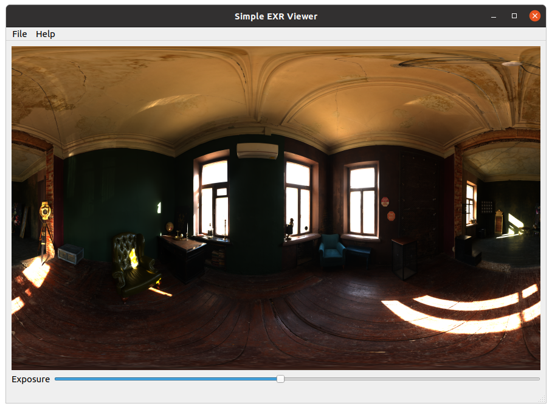

# Simple EXR viewer

> :warning: Application is still in development. No versions released yet.

The simple EXR viewer is a simple QT based application that can load EXR images.
Capabilities that must be supported:
* Sliding the exposure
* Converting EXR to LDR
* Saving EXR pictures to RGB or PNG.



## Build

The build has been tested on Ubuntu20.04 only for now.
The application depends on Qt6. Please set the CMAKE_PREFIX_PATH in the CMakeLists.txt to the location where your Qt6 
framework is installed. For more information on dependencies, check out the dependencies used section.

The build script makes use of conan. All dependencies, except Qt6 are fetched via the conan center package repository.
I am using conan 1.42.0 as of writing.

You do not necessarily need to use conan. You can use system installs as well. You then need to make sure a findpackage script
is available so that the packages can be resolved.

```shell
mkdir build && cd build
conan install .. -s build_type=Release
cmake -DCMAKE_BUILD_TYPE=Release -DCMAKE_INSTALL_PREFIX=install ..
make -j4
```

## Dependencies used

The following dependencies have been used.
* Qt 6.2.1
* tinyExr 1.0.0
* fmt 8.0.1